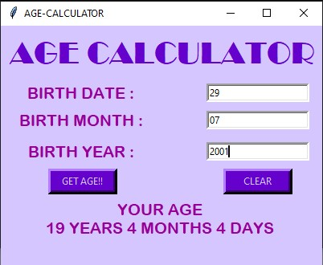
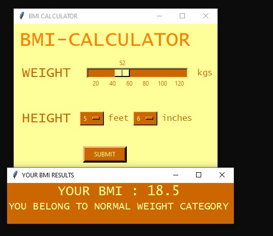
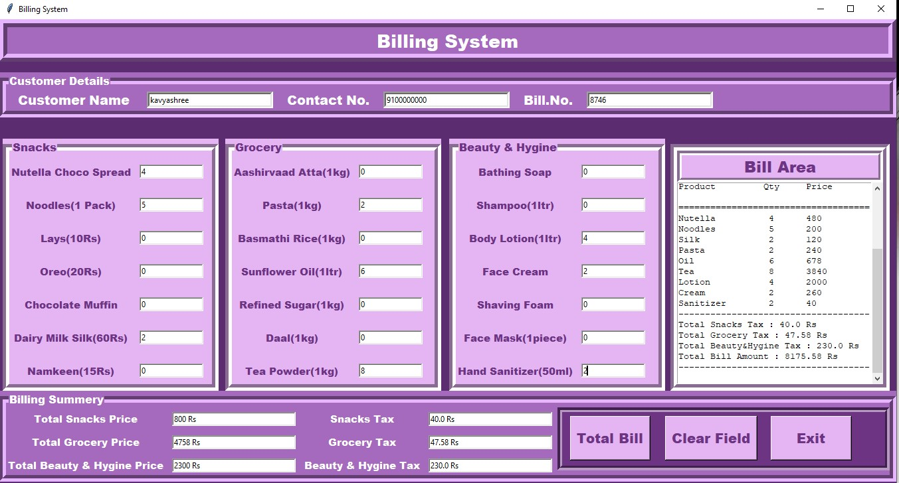
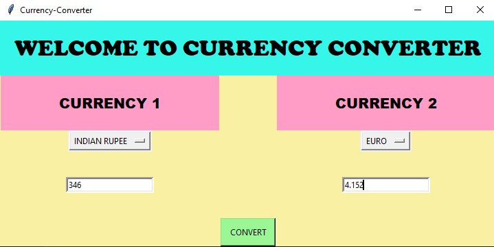
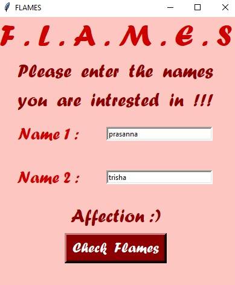

*****PYTHON TKINTER GUI PROJECTS*****

1.AGE CALCULATOR : 

I have made this age calculator app using basic widgets such as Labels, Buttons, Entry fields with a little bit of logic. Have a look at the output.

2.BMI CALCULATOR :

I have made this BMI calculator app using widgets such as Slider, Dropdown Menu, Buttons with a little bit of logic. Have a look at the output.

3.BILLING SYSTEM : 

This is little bit complicated when compared to other listed projects. The widgets used are Labels, Buttons, Text Area, Label Frames, Frames, Entry Fields. Have a look at the output.

4.CURRENCY CONVERTER :

This is super easy and fun project to do. Feel free to refer my code and, I am always open to better codes and suggestions.

5.FLAMES GAME : 

Kids of age of 8 to 12 play this game. Its basically to put our crush names and do FLAMES(Friends,Love,Affection,Marriage,Enemy,Sibling). The logic to play this game is first cancel all the common characters from the both the names and then count the remaining ones. This count serves as iterating factor. Loop over FLAMES word with this count and cancel letters everytime the count ends. Take a look at the output.

6.TIC TAC TOE GAME : 

Its a 2 player game. I have made this with Frames, Buttons and Entry Boxes. Have a look at the output.

