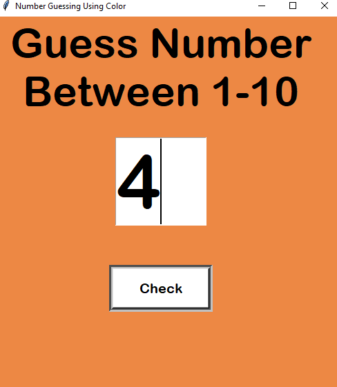
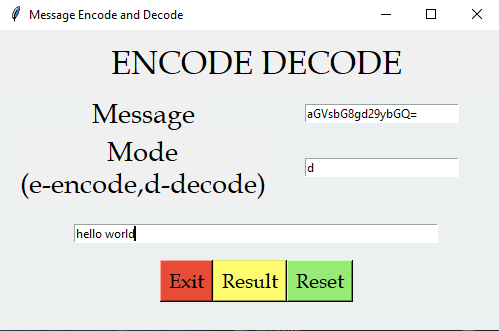

*****PYTHON TKINTER GUI PROJECTS*****

1.AGE CALCULATOR(AGE CALCULATOR.py):

I have made this age calculator app using basic widgets such as Labels, Buttons, Entry fields with a little bit of logic. Have a look at the output.

Briefing the steps to create age calculator are:

1.Importing the module – tkinter

2.Create the main window (container)

3.Add any number of widgets to the main window.

4.Apply the event Trigger on the widgets.

2.BMI CALCULATOR(BMI CALCULATOR.py):

I have made this BMI calculator app using widgets such as Slider, Dropdown Menu, Buttons with a little bit of logic. Have a look at the output.

3.BILLING SYSTEM : 

This is little bit complicated when compared to other listed projects. The widgets used are Labels, Buttons, Text Area, Label Frames, Frames, Entry Fields. Have a look at the output.

4.CURRENCY CONVERTER :

This is super easy and fun project to do. Feel free to refer my code and, I am always open to better codes and suggestions.

The conversion in this project is based on today’s value. I have created 5 conversions which includes,

1.Indian Rupee to American Dollar

2.Indian Rupee to Yen

3.Indian Rupee to Euro

4.Indian Rupee to Bitcoin

5.Indian Rupee to Saudi Riyal

I have used GUI(Graphical User Interface) to complete this project. The widgets used in this project are Labels, Buttons and Drop down menus.

5.FLAMES GAME : 

Kids of age of 8 to 12 play this game. Its basically to put our crush names and do FLAMES(Friends,Love,Affection,Marriage,Enemy,Sibling). The logic to play this game is first cancel all the common characters from the both the names and then count the remaining ones. This count serves as iterating factor. Loop over FLAMES word with this count and cancel letters everytime the count ends. Take a look at the output.

6.TIC TAC TOE GAME : 

Its a 2 player game. I have made this with Frames, Buttons and Entry Boxes. Have a look at the output.

7.ZODIAC SIGN CALCULATOR : 

It calculates your Zodiac sign with input given as Date and Month. Have a look at the output.

8.Register/Login form : 

This is a GUI application to register and login.

9.Number Guessing Game using colours:

Basically its a number guessing game from 1 to 10, the trick involved in this is guessing the number using color as a hint. The closer you are to the correct number the warmer
the color is and far away from the number is indicated by blue shaded colors. So the correct number is indicated with red color and as you move away from the number it turns bluish. 

10.Encode-Decode:

Encode Decode is a GUI python program. The modules used are tkinter and base64. Any text can be encoded and decoded using base64 module. The procedure working behind base64 is the input text, which is a string is first converted to ASCII form. Then its converted to 8bit binary data. Regrouped to 6 bit binary digits. The binary form is then decoded to ASCII and matched with base64 encoding/decoding table.

11.COVID-INFORMATICA:

This project has the concepts of web scraping and tkinter gui library. For web scraping I have used requests and beautifulsoup library. It shows the total cases, total recovered and total deaths of any country.  The values keep getting updated every 24 hours. The data is collected for the website https://www.worldometers.info/coronavirus/  . The code can excecute only when you are connected to the internet.

12.Sudoku Solver:
 
This is a sudoku solver which demostrates the consept of recursion and backtracking. Backtracking approach is used when all possible solutions are to be found out with given contrains. A good sudoku puzzle has unique solution. The basic idea behind is checking every number at blank space position and then backtracking is executed when the solution goes wrong that means not finding any number to fit into empty box. The GUI interface is made by using tkinter module in python. Every number is checked with certain conditions to fit into empty boxes. The conditions are, if the number to be checked is present in blank box row or column or in the set of box then that number cannot fit inside empty box. 
Feel free to check out my code and suggestions for optimization is always welcomed.

13.URL Shortener:

In this project I have used bitly_api to generate short url's. Bitly is a trusted website which allows to create short url's. It stores all the url's in the form of dictionary data type. You can get your own access token by simply signing up on bitly website and in profile section there will be an option generate token. Take a look at the output screen

